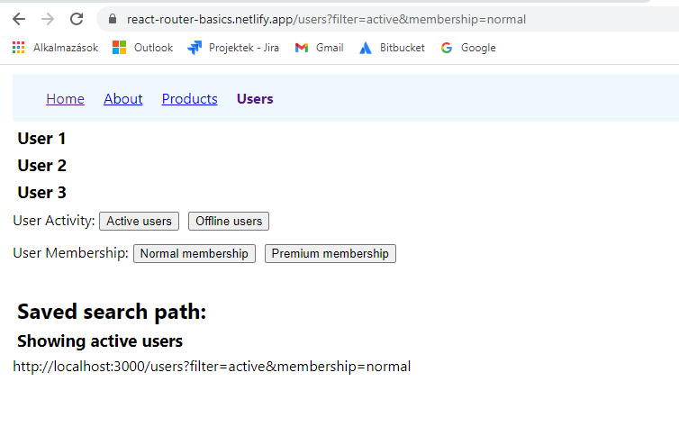

# React router basics

## What is it about?

- Configure Routes
- Links (NavLink)
- Active links (useNavigate)
- No Match Route
- Nested Routes (Outlet)
- Index Route
- Dynamic Routes
- URL Params (useParams)
- Search Params (useSearchparams)
- Realative Links
- Lazy Loading


## Install yarn, Create yarn project, start yarn project

```
npm install -global yarn

yarn create react-app testproject

```

## Add Components

```
yarn add react-reouter-dom@6
```

## Start and test 

```
yarn start
```

OR

https://react-router-basics.netlify.app/


## First Look:




